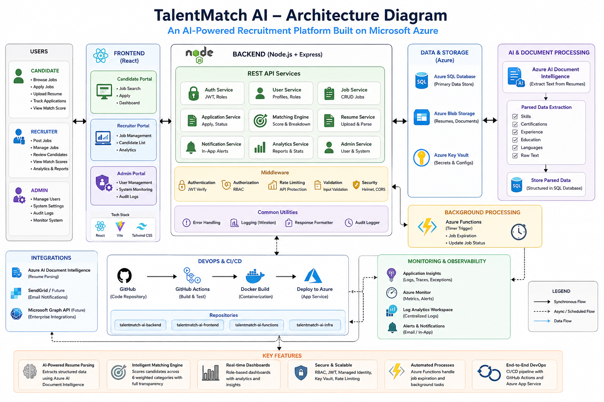

# TalentMatch AI

**An AI-powered recruitment platform that matches candidates to jobs using a transparent, weighted scoring engine — built end-to-end on Azure, from resume parsing to automated CI/CD deployment.**

Candidates upload a resume; Azure AI Document Intelligence extracts their skills, education, experience, certifications, and projects. Recruiters post jobs with real, structured requirements. A custom matching engine scores every application across six weighted categories and shows exactly *why* a candidate got the score they did — not just a bare percentage.

---

## Table of Contents

- [Live Demo](#live-demo)
- [Why This Project](#why-this-project)
- [Core Features](#core-features)
- [The Matching Engine](#the-matching-engine)
- [The AI Resume Parsing Pipeline](#the-ai-resume-parsing-pipeline)
- [Tech Stack](#tech-stack)
- [System Architecture](#system-architecture)
- [Database Design](#database-design)
- [Security Implementation](#security-implementation)
- [Automation & Background Processing](#automation--background-processing)
- [Monitoring & Observability](#monitoring--observability)
- [Testing Strategy](#testing-strategy)
- [CI/CD Pipeline](#cicd-pipeline)
- [Known Limitations](#known-limitations)
- [Development Phase Summary](#development-phase-summary)
- [Getting Started](#getting-started)
- [Author](#author)

---

## Live Demo

- **Frontend:** [app-talentmatch-web-11052.azurewebsites.net](https://app-talentmatch-web-11052.azurewebsites.net)
- **Backend API health check:** [app-talentmatch-api-11052.azurewebsites.net/health](https://app-talentmatch-api-11052.azurewebsites.net/health)

---

## Why This Project

Most portfolio "job board" projects stop at CRUD — post a job, apply to a job. TalentMatch AI goes further: it actually tries to answer the question a real recruiter asks — *how well does this person actually fit this role, and why?*

That meant building a genuine scoring algorithm rather than a keyword-count gimmick, being honest about what AI extraction can and can't reliably do, and being transparent enough that both a candidate and a recruiter can see the reasoning behind every score. It also meant treating this as a real production system, not just a demo: real Azure infrastructure, real security hardening, real automated testing, and a real CI/CD pipeline — not shortcuts taken because "it's just a portfolio project."

---

## Core Features

### For Candidates
- Resume upload with automated parsing (skills, certifications, languages, education, experience, projects) via Azure AI Document Intelligence
- A completeness score reflecting how much structured data was confidently extracted
- Real-time match scores against every job applied to, with a full breakdown modal (per-category score, missing skills, plain-language reasons)
- "Improve Your Match" recommendations aggregated from missing skills across all applications
- Self-service score recalculation after updating a profile — no need to wait on a recruiter
- Manual profile editing across Education, Experience, Skills, Certifications, Languages, and Projects, with AI-extracted entries clearly marked pending review until confidence is high enough to auto-verify

### For Recruiters
- Job posting with structured requirements: skills, certifications, languages, experience range, education
- Candidate pipeline with real match scores, sortable and filterable
- One-click "Rank Candidates" action to recalculate scores for every applicant to a job at once
- Analytics dashboard: application trends over time, skill distribution, hiring funnel, and match-score statistics both per-job and in aggregate

### For Admins
- User and platform management, audit logging, account suspension controls

### Platform-Wide
- Automated job expiration via a genuinely scheduled Azure Function — no manual intervention required
- In-app notifications generated by real events (new applications, status changes, resume processed)
- Rate limiting on every brute-force-sensitive endpoint, thresholds scaled to actual risk
- Real exception and usage telemetry via Application Insights, with a live email alert on server errors

---

## The Matching Engine

Six weighted categories, with graceful degradation when a job doesn't specify a requirement:

| Category | Weight | How It's Scored |
|---|---|---|
| **Skills** | 40% | Matched **live** against the candidate's actual resume text |
| **Experience** | 25% | Years calculated from verified work history vs. the job's required range |
| **Education** | 10% | Degree level + field-of-study overlap |
| **Certifications** | 10% | Matched against a normalized certification catalog |
| **Projects** | 10% | Project descriptions checked for the job's required skills |
| **Languages** | 5% | Matched against a normalized language catalog |

**Graceful weight redistribution:** if a job doesn't specify, say, preferred languages, that 5% doesn't count against the candidate at all — the remaining applicable categories scale up proportionally to fill the full 100%. A candidate is never penalized for a requirement the job never actually asked for.

**Full transparency:** every computed match includes a breakdown of every applicable category's score and weight, an explicit note on which categories were excluded and why, a matched/missing skills list, and plain-language reasons — surfaced through a dedicated breakdown modal available to both candidates and recruiters. A bare percentage with no explanation was a deliberate thing to avoid.

**When scores are calculated:**
- Automatically, the instant a candidate applies
- On demand, by the candidate, via a self-service recalculate button
- In bulk, by the recruiter, via "Rank Candidates" for an entire job's applicant pool

---

## The AI Resume Parsing Pipeline

Resume text is extracted using Azure AI Document Intelligence's prebuilt-read model, then split into rough sections (Education, Experience, Skills, Certifications, Languages, Projects) via header detection before category-specific extraction runs.

**Certifications and Languages** are matched against a fixed dictionary — appropriate here since these are small, standardized vocabularies (a handful of well-known certification codes and language names).

**Education and Experience** use heuristic pattern matching (degree-level keywords, date-range parsing), with a genuinely variable confidence score based on how much expected structure was actually found. Entries scoring 80+ confidence auto-verify immediately; lower-confidence entries are marked **Pending Review**, requiring the candidate to confirm them before they count toward a match score — a deliberate safeguard against a bad extraction silently corrupting a profile or inflating a score with no visibility.

**Skills matching — a real bug, found and fixed:** the parser originally only recognized skills from a fixed, hardcoded dictionary. During testing, a real gap surfaced: genuine, clearly-stated skills — Azure-specific terms like `Entra ID`, `Azure Monitor`, `Azure Service Bus` — went completely undetected simply because they weren't pre-loaded into that list, no matter how obviously they appeared in the resume. Expanding the dictionary was only a temporary patch; any new domain (healthcare, accounting, anything not anticipated in advance) would fail the exact same way.

**The permanent fix:** Skills matching was rebuilt to check each of a job's required skills as a **live, direct match against the candidate's actual resume text** — the same approach already used successfully for Projects matching — removing the dictionary dependency for this category entirely. This makes Skills matching accurate regardless of industry or vocabulary.

---

## Tech Stack

| Layer | Technology |
|---|---|
| Frontend | React, Vite, Tailwind CSS |
| Backend | Node.js, Express |
| Database | Azure SQL Database |
| File Storage | Azure Blob Storage |
| AI / Document Processing | Azure AI Document Intelligence |
| Background Jobs | Azure Functions (timer trigger) |
| Authentication | JWT, bcrypt |
| Secrets Management | Azure Key Vault + Managed Identity |
| Monitoring | Application Insights, Azure Monitor |
| Testing | Jest (backend + frontend) |
| CI/CD | GitHub Actions |
| Hosting | Azure App Service |
| Version Control | Git, GitHub |

---
## 🏗️ Architecture Diagram

<p align="center">
  
</p>

---

## System Architecture

```
talentmatch-ai-azure-fullstack/
├── talentmatch-ai-backend/     Node/Express API, matching engine, resume parser
├── talentmatch-ai-frontend/    React SPA (candidate, recruiter, admin dashboards)
├── talentmatch-ai-functions/   Azure Functions — scheduled job expiration
├── talentmatch-ai-infra/       Azure provisioning scripts
├── .github/workflows/          CI/CD — one automated pipeline per project
└── Documentation/              Full technical + user documentation
```

**Data flow:** a candidate uploads a resume → stored in Blob Storage → processed by Document Intelligence → parsed into structured skills/education/experience/etc. → stored in Azure SQL. On application, the matching engine gathers the candidate's data and the job's requirements, computes a weighted score, and stores the full breakdown alongside the application. Recruiters view scored, ranked candidates and can recalculate at any time.

**Azure resources provisioned:**

| Resource | Purpose |
|---|---|
| Resource Group | Container for all project resources |
| Azure SQL Server + Database | Primary relational data store |
| Storage Account | Resume file storage |
| Document Intelligence | Resume text extraction |
| Key Vault | Secure secret storage |
| App Service (backend) | Hosts the Node/Express API |
| App Service (frontend) | Hosts the built React SPA |
| Function App | Scheduled job-expiration timer |
| Application Insights | Telemetry, exceptions, alerting |

---

## Database Design

The schema was normalized progressively — most notably, **Certifications was rebuilt** from a flat per-candidate table into a shared catalog with a junction table, mirroring the pattern already used for Skills, to support consistent analytics and job-side requirement matching.

**Key tables:** Users, Candidates/Recruiters, Jobs, Applications (carries `MatchScore` and a full `MatchBreakdown`), Skills/JobSkills/CandidateSkills, CertificationsCatalog/JobCertifications/CandidateCertifications, Languages/JobLanguages/CandidateLanguages, Educations/Experiences/Projects, ResumeExtractions, Notifications, AuditLogs.

**Key design decisions:**
- Applications can't cascade-delete from Jobs (a SQL Server multiple-cascade-path restriction) — a job with applications must be *closed*, not deleted, preserving history
- Education/Experience carry a `VerificationStatus` and `ConfidenceScore` for the AI-verification workflow described above
- `ResumeExtractions` stores only the *current* resume's text (`IsCurrent` flag) — a deliberate middle ground between full version history and none at all

---

## Security Implementation

- **JWT authentication** (7-day expiry) + **bcrypt** password hashing (12 salt rounds)
- **Role-based access control** enforced on every protected route
- **Rate limiting**, scaled to actual risk per endpoint:

  | Endpoint | Limit |
  |---|---|
  | Login | 5 attempts / 15 min |
  | Registration | 10 accounts / hour |
  | Forgot Password | 5 requests / hour |
  | Resume Upload | 10 uploads / hour *(keyed by user — protects against Document Intelligence cost/quota abuse, not just brute force)* |
  | Password Change | 10 attempts / hour |

- **Azure Key Vault + Managed Identity** — the backend authenticates to Key Vault using a system-assigned Managed Identity, with zero credentials stored in code or config. **Verified end-to-end**, not just configured: a live login request against the deployed backend successfully resolved its real database password through Key Vault via Managed Identity.
- Input validation (express-validator), secure HTTP headers (helmet), CORS restricted to explicit allowed origins, and parameterized SQL queries throughout — no string-concatenated SQL anywhere in the codebase.

---

## Automation & Background Processing

- **Notifications** generated on real events — a recruiter is notified when someone applies to their job; a candidate is notified when their status changes or their resume finishes processing.
- **Scheduled job expiration** via an Azure Function on a daily timer, automatically closing postings left "Open" for 30+ days. This is the first genuinely unattended, scheduled process in the platform — everything else runs only in direct response to a user action.

---

## Monitoring & Observability

Application Insights auto-collects HTTP requests, performance, and dependency calls. Beyond that, **custom telemetry** tracks business events (`ApplicationSubmitted`, `ResumeProcessed`) and **explicitly reports caught exceptions** — since exceptions handled by Express's centralized error handler aren't picked up by automatic unhandled-exception tracking on their own. An Azure Monitor alert with a real email action group fires on elevated server error rates.

---

## Testing Strategy

**Backend — 40 tests across 5 suites:** matching engine (experience parsing, degree-level detection, full match computation including graceful exclusion), resume extractor (email/phone/URL/skill/cert extraction), password hashing, JWT sign/verify, and auth controller logic (duplicate email, wrong password, suspended accounts) with the database layer mocked.

**Frontend — 14 tests, 1 suite:** formatter utilities covering initials generation, salary formatting, confidence labeling, and status badge styling, including edge cases.

Core scoring and parsing logic was independently executed against the real codebase during development — not just written and assumed correct — to verify behavior before it was ever relied upon.

---

## CI/CD Pipeline

Two independent GitHub Actions workflows — one per project — each triggered only when its own folder changes, using path-based filtering:

1. Checkout → Set up Node → Install dependencies
2. **Run the full test suite** — a failing test blocks deployment before it can happen
3. *(Frontend only)* Build the production bundle, with the live backend URL injected at build time
4. Deploy to the corresponding Azure App Service

Pushing to `main` is now sufficient to test and deploy automatically — no manual deployment step required for ongoing development.

---

## Known Limitations

Documented honestly, not glossed over:

- Education/field-of-study matching is heuristic (keyword and word-overlap based), not a true semantic understanding of degree equivalence
- Certifications and Languages remain dictionary-matched rather than live-text-matched — a deliberate scope decision given their smaller, more standardized vocabularies, unlike Skills
- Resume file versioning is intentionally out of scope — only the current resume's extracted text is retained
- Real email notifications were scoped out in favor of in-app notifications only

---

## Development Phase Summary

| Phase | Focus | Status |
|---|---|---|
| 1-4 | Requirements, frontend build, initial design | ✅ Complete |
| 5 | Azure environment provisioning | ✅ Complete |
| 6 | Database design and schema | ✅ Complete |
| 7-8 | Backend API and frontend integration | ✅ Complete |
| 9-10 | Resume upload and AI-driven parsing | ✅ Complete |
| 11 | Intelligent matching engine | ✅ Complete |
| 12 | Recruiter analytics | ✅ Complete |
| 13 | Notifications and scheduled automation | ✅ Complete |
| 14 | Security hardening | ✅ Complete |
| 15 | Monitoring and logging | ✅ Complete |
| 16 | Automated testing | ✅ Complete |
| 17 | CI/CD and deployment automation | ✅ Complete |

---

## Getting Started

Each project is independent — install and run separately.

```bash
# Backend
cd talentmatch-ai-backend
npm install
cp .env.example .env   # fill in your own Azure SQL / Storage / Document Intelligence credentials
npm run dev

# Frontend
cd talentmatch-ai-frontend
npm install
npm run dev
```

```bash
# Running tests
cd talentmatch-ai-backend && npm test
cd talentmatch-ai-frontend && npm test
```

Full setup, including Azure resource provisioning, is documented in [`Documentation/`](./Documentation).

---

## Author

**Hikmat Shinwari**
Cloud/DevOps & IT Support professional — [LinkedIn](#) · [GitHub](https://github.com/shinwari27)
